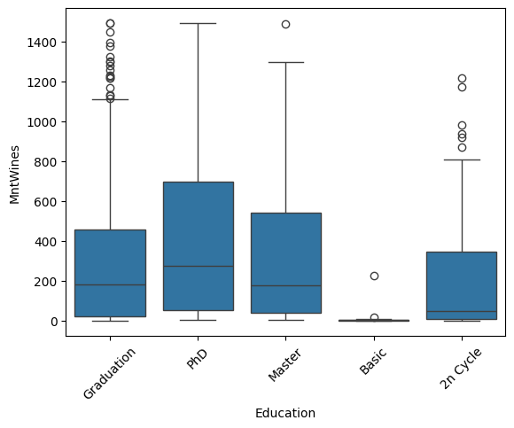

<!-- Banner / Header -->
<p align="center">
  
</p>

<h1 align="center">📊 Customer Personality Analysis — Hypothesis Testing</h1>
<p align="center">Analyzing whether education level impacts wine spending behavior using statistical methods.</p>

---

## 🚀 Project Overview  
Understanding customer behavior is crucial for designing effective marketing strategies.  
In this project, we analyze whether **customers with different education levels spend differently on wine**.

The analysis includes:
- Exploratory Data Analysis (EDA)
- Descriptive statistics
- Visualization (Boxplot)
- Normality testing
- Kruskal–Wallis hypothesis test
- Interpretation & insights for business context

---

## 🧰 Tech Stack & Libraries  
<p>
  
  
  
  
  
  
</p>

---

## ❓ Problem Statement  
**Does a customer’s education level influence their wine spending (MntWines)?**

This project aims to statistically test whether wine spending differs across education groups.

---

## 🎯 Goals  
- Understand customer demographic patterns  
- Evaluate differences in wine spending across education levels  
- Apply non-parametric hypothesis testing  
- Generate insights for targeted marketing strategies
  
---

## 📊 Dataset  
The dataset comes from a marketing campaign dataset containing:  

- **Demographics**: Education, Marital Status, Income, Age  
- **Spending Behavior**: MntWines, MntMeatProducts, MntFishProducts, etc.  
- **Customer Behavior**: Recency, Number of purchases, Channels used  

**Focus variables for this project:**  
- `Education` (categorical)  
- `MntWines` (numeric, total wine spending in last two years) 

---

## 🔍 EDA Summary  

### 📌 1. Understanding Key Variables  
- **Education** → Category of customer education level  
- **MntWines** → Total wine spending in the last 2 years  

### 📌 2. Descriptive Statistics  
- Wine spending ranges from **0 to 1493**  
- Distribution is **right-skewed**  
- Higher-education groups (PhD, Master) show **higher average and median wine spending**  
- “Basic” group shows **lowest spending**  

---

## 📈 Visualization

### 🟦 Wine Spending Across Education Groups  
Boxplot used to compare median & distribution of wine spending across education categories.





**Insights:**
- Higher education groups (**PhD, Master**) show **higher median spending**  
- Basic education has the **lowest wine spending**  
- Many outliers exist → small portion of customers buy premium wine heavily  
- Distribution is **right-skewed**, confirming non-normal behavior  

---

## 📉 Normality Check  

Normality tested using:  
✔ **Skewness**  
✔ **Shapiro–Wilk test**  

**Result:**  
- All education groups have **p-value < 0.05**  
- Data is **NOT normally distributed**  
- ANOVA **cannot** be used  

➡ **A non-parametric test is required**

---

## 🧪 Hypothesis Testing — Kruskal–Wallis Test  

### **Hypotheses**
- **H₀:** Median wine spending is the same across all education levels  
- **H₁:** At least one education group differs in median wine spending  

### **Test Used:**  
💠 **Kruskal–Wallis (non-parametric)**  
→ Suitable for **non-normal**, **categorical groups > 2**

### **Result:**  
- **p-value < 0.05**  
- **Reject H₀**

### ✅ **Conclusion**
Education level **significantly affects** wine spending.

---

## 📘 Final Insights  

- Customers with **higher education levels** tend to spend **more on wine**  
- Spending differs significantly between education groups  
- Useful for:  
  - Customer segmentation  
  - Targeted marketing for premium products  
  - Personalized promotion strategies  

---

## 📁 How to Reproduce  
1. Download the dataset (`marketing_campaign.csv`) and the analysis notebook inside the `notebooks/` folder.
2. Open the notebook in Google Colab or Jupyter Notebook.
3. Make sure the dataset is placed in the correct path as used in the notebook.
4. To display visualizations in the README, upload the plot images into the `images/` folder and reference them like this:

```markdown

```

---

## 🙌 Acknowledgements  
This project was completed as part of the **Statistics for Data Science — Hypothesis Testing**.

